<h1 align="center">Hi, I'm Sher Muhammad Iqbal</h1>
<h3 align="center">Full-Stack Developer — Angular · NestJS · Real-Time Systems</h3>

  Building distributed backends, real-time streaming pipelines, and AI-powered products. 
  2+ years across 3 companies · Currently at <strong>HS Technologies</strong> · BS CS @ UET Lahore (2027)

  
  
  
  

---

### What I'm Doing

Building distributed **NestJS** backends and **Angular** frontends at **HS Technologies**

Owned the live-streaming module (FFmpeg → MediaMTX → WebRTC) for an enterprise vehicle surveillance platform

Shipping real-time AI voice agents with the OpenAI Realtime API + WebRTC

Deepening backend skills — distributed systems, message queues, and DB internals

**Ask me about:** Angular, NestJS, React/Next.js, WebRTC, and real-time systems

---

### Tech Stack

**Core**

  
  
  
  
  
  
  
  

**Also strong with**

  
  
  
  
  
  

**AI / Real-time**

  
  
  
  

**Also used:** FFmpeg · MediaMTX · React Native · Kotlin · Electron · Deno · FastAPI · C# · PHP · MySQL · MongoDB · Firebase · Supabase · Stripe · Twilio · SignalR · RxJS · Zustand

---

### Featured Projects

**VXS — Vehicle Surveillance & Access Control** *(company project)*
`NestJS` `TypeScript` `PostgreSQL` `TypeORM` `Socket.IO` `FFmpeg` `MediaMTX` `WebRTC`
Contributed to a 33-module NestJS backend for enterprise vehicle monitoring across a distributed VXS + DPU architecture. Owned the live-streaming pipeline (FFmpeg → MediaMTX → WebRTC/WHEP) with automatic reconnection and stuck-stream detection, plus a real-time WebSocket gateway for ANPR events and alarms.

**CallDraft — AI Voice Agent** *(personal project)*
`Next.js` `TypeScript` `OpenAI Realtime API` `WebRTC`
Browser-based AI voice agent with live speech-to-speech conversation at sub-800ms latency, using ephemeral-token WebRTC auth, live transcript, and a real-time latency indicator.

**Buy4Me — Cross-Border E-Commerce**
`Angular 21` `NestJS 11` `MySQL` `Prisma` `Nx Monorepo` `Stripe` `Qdrant`
Production platform for the Azerbaijan market: 4-app Nx monorepo, Qdrant-powered semantic product search, and a Stripe multi-currency wallet system, deployed on a VPS with PM2 + CI/CD.

**PM Suite — Project Management Platform**
`Angular` `Deno` `PostgreSQL`
Full-stack PM platform combining Kanban boards, a Notion-style document editor, real-time messaging, and KPI dashboards — built as an offline-capable PWA with JWT auth and RBAC.

**Real-Time Billing Engine**
`Node.js` `Express` `TypeORM` `PostgreSQL` `Socket.IO`
Server-authoritative medical billing system with pessimistic locking for concurrent session safety, doctor-client queue matching, and heartbeat-based session monitoring.

---

### GitHub Stats

  
  

  

